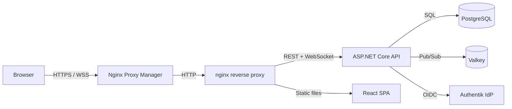

<div align="center">

# 🗨️ Little Chat

**Self-hosted real-time group chat. Own your conversations.**

[](./LICENSE)
[](https://dotnet.microsoft.com/)
[](https://react.dev/)
[](https://www.typescriptlang.org/)
[](https://www.postgresql.org/)
[](https://docs.docker.com/compose/)
[](https://hub.docker.com/r/mituw16/littlechat)

*Slack-inspired, deliberately minimal, runs entirely on your own infrastructure.*

**[📖 Documentation & self-hosting guide →](https://github.com/mattlittle16/LittleChat/wiki)**

</div>

---

## ✨ Features

| | |
|---|---|
| 💬 **Real-time messaging** | WebSocket-powered via ASP.NET Core SignalR |
| 🏠 **Rooms & Direct Messages** | Same underlying primitive, unified experience |
| ✍️ **Inline markdown editor** | *italic*, **bold**, `code`, ~~strikethrough~~ as you type |
| 😄 **Emoji shortcuts** | Type `:lol:` → 😂, or pick from the GUI emoji picker |
| 👍 **Reactions** | Emoji reactions on any message, with notifications |
| 📎 **File attachments** | Images, video, and files up to 200 MB per message |
| @ **Mentions** | Autocomplete with browser and toast notifications |
| 🟢 **Live presence** | Real-time online/offline indicators |
| 🔍 **Full-text search** | Across all public rooms |
| ✏️ **Edit & delete** | Your own messages, always |
| 🔔 **Notification settings** | Per-room: all messages, mentions only, or muted |
| 👤 **User profiles** | Avatar upload, display name, onboarding wizard |
| 🗂️ **Topic management** | Create, join, reorder, and discover public topics |
| ⭐ **Highlights** | Star any message to save it; view all highlights per topic or DM |
| 🔖 **Bookmarks** | Bookmark messages for quick personal reference across all rooms |
| 📋 **Daily Digest** | Per-room summary of recent highlights, polls, and activity |
| 📊 **Polls** | Create single or multi-choice polls directly in a message |
| 🔗 **Link previews** | URLs in messages automatically unfurl with title and description |
| 🛡️ **Admin panel** | User management, banning, topic control, and full audit log |
| 🔄 **Update detection** | In-app banner when a new version is deployed |
| 🔐 **OIDC authentication** | Any OIDC-compliant identity provider — no passwords, no registration |
| 📦 **Offline resilience** | IndexedDB outbox queues messages during connectivity gaps |
| 🔗 **URL-based navigation** | Browser URL reflects current topic, DM, or panel — reload returns you exactly where you were |

---

## 🏗️ Architecture



The backend is a **modular monolith** — nine vertical modules deployed as a single unit with compile-time isolation enforced by architecture tests. Cross-module communication uses two patterns:

- **Shared interfaces** (`IPresenceService`, `IRealtimeNotifier`, `IUserLookupService` …) — for direct cross-module calls via DI, without exposing internal implementations
- **Integration events** (`MessageSentIntegrationEvent`, `UserFirstLoginIntegrationEvent` …) — for decoupled notifications via an in-memory event bus

Neither pattern creates a hard dependency on another module's internals, keeping each module independently extractable if scaling ever demands it.

---

## 🛠️ Tech Stack

| Layer | Technology |
|---|---|
| **Backend** | C# / .NET 8, ASP.NET Core, MediatR 12.x |
| **Real-time** | ASP.NET Core SignalR + Valkey (Redis-compatible) backplane |
| **Database** | PostgreSQL — raw SQL via Npgsql, EF Core for migrations |
| **Frontend** | React 19, TypeScript 5.9, Vite 7 |
| **Styling** | Tailwind CSS v4, shadcn/ui (slate theme) |
| **State** | Zustand v5 |
| **Editor** | Tiptap (inline markdown compose box) |
| **Auth** | OIDC → JWT Bearer tokens |
| **Image processing** | SixLabors.ImageSharp (resize, HEIC/HEIF support) |
| **Drag & drop** | @dnd-kit (topic sidebar reordering) |
| **Virtualisation** | — (cursor-based pagination bounds DOM size) |
| **Infrastructure** | Docker Compose, nginx, Nginx Proxy Manager |
| **CI/CD** | GitHub Actions → self-hosted runner |

---

## 🚀 Getting Started

### Prerequisites

- [Docker Desktop](https://www.docker.com/products/docker-desktop/)
- [.NET SDK 8.x](https://dotnet.microsoft.com/download) *(backend development only)*
- [Node.js 20+](https://nodejs.org/) *(frontend development only)*
- An OIDC-compliant identity provider (e.g. Authentik, Keycloak, Auth0)

### 1. Configure your environment

```bash
git clone <repo-url> little-chat
cd little-chat
cp .env.example .env
```

Open `.env` and fill in your values — see `.env.example` for all available options with inline documentation.

### 2. Configure your identity provider

Create an **OAuth2/OpenID Connect** application in your identity provider:

| Setting | Value |
|---|---|
| Client type | Confidential |
| Redirect URI | `http://localhost:3000/auth/callback` |

Paste the generated Client ID, Client Secret, and Authority URL into your `.env`.

### 3. Run it

```bash
docker compose up
```

| Service | URL |
|---|---|
| App | http://localhost:3000 |
| Backend API | http://localhost:5000 |
| SignalR Hub | ws://localhost:5000/hubs/chat |

Both the backend (`dotnet watch`) and frontend (Vite) support hot reload — file changes reflect immediately.

### 4. Run the tests

```bash
# Backend (unit + architecture tests)
cd src/backend
dotnet test

# Frontend (unit tests + lint)
cd src/frontend
npm test && npm run lint
```

---

## 📁 Project Structure

```
├── src/
│   ├── backend/
│   │   ├── src/
│   │   │   ├── API/                  # Composition root — Program.cs, middleware
│   │   │   ├── Shared/               # Contracts, interfaces, shared infrastructure
│   │   │   └── Modules/
│   │   │       ├── Identity/         # User sync, OIDC claims, profile management
│   │   │       ├── Messaging/        # Rooms, DMs, messages, attachments
│   │   │       ├── Presence/         # Online/offline tracking (Valkey TTL)
│   │   │       ├── Reactions/        # Emoji reactions
│   │   │       ├── Search/           # Full-text message search
│   │   │       ├── Files/            # File upload, serving, and image processing
│   │   │       ├── Notifications/    # Per-room preferences, mention & reaction alerts
│   │   │       ├── RealTime/         # SignalR hub, event handlers
│   │   │       └── Admin/            # User management, banning, topic control, audit log
│   │   └── tests/
│   │       ├── Unit/
│   │       └── Architecture/         # NetArchTest module boundary enforcement
│   └── frontend/
│       └── src/
│           ├── components/
│           ├── hooks/
│           ├── services/             # API client, SignalR client, auth
│           └── stores/               # Zustand state (messages, rooms, presence…)
├── docker/nginx/nginx.conf           # Reverse proxy config
├── docker-compose.yml                # Local dev
├── docker-compose.prod.yml           # Production
└── .env.example                      # All config options documented
```

---

## 🌐 Production Deployment

Deployment is fully automated via GitHub Actions on every push to `master`.

**Server prerequisites:**
- Docker + Docker Compose
- Self-hosted GitHub Actions runner
- Nginx Proxy Manager (or equivalent) for TLS termination
- A shared Docker network named `app-network`

```bash
# One-time server setup
docker network create app-network
```

Configure **GitHub Secrets** for every variable listed in `.env.example` — the CI workflow assembles the `.env` at deploy time. Secrets are never stored on disk between deployments.

### Optional: Analytics & head scripts

The frontend `index.html` contains a `<!-- HEADSCRIPTS -->` placeholder that is replaced at build time. You can inject any `<script>` or `<link>` tags (e.g. an analytics snippet) by setting a **GitHub Actions variable** (not a secret) named `HEADSCRIPTS` on your repository:

> **Settings → Secrets and variables → Actions → Variables → New repository variable**
> Name: `HEADSCRIPTS`
> Value: your script tags, e.g. `<script defer src="..."></script>`

If `HEADSCRIPTS` is not set the placeholder is simply removed and the app works with no analytics.

> **Note:** Enable WebSocket proxying on your NPM proxy host for the backend — required for SignalR connections.

---

## 💡 Design Decisions

A few intentional choices worth understanding:

- **Persist-before-broadcast** — messages are written to the database before being broadcast. No phantom messages.
- **Modular monolith** — modules deploy together but are architecturally isolated; boundaries are enforced by automated architecture tests.
- **Hard deletes only** — no soft deletes anywhere in the codebase.
- **30-day message TTL** — messages are hard-deleted after 30 days by a background cleanup service.
- **JWT in localStorage** — an accepted tradeoff to support the offline-first IndexedDB outbox.
- **DMs excluded from search** — global search covers public rooms only.
- **System messages use `user_id = NULL`** — ban notices and system events are stored as regular messages but excluded from unread counts and notifications. The sender name is persisted so it survives page reloads.
- **Admin audit log** — all admin actions (bans, unbans, member changes, topic create/delete) are recorded with timestamp, actor, and target.
- **Token blocklist in Valkey** — banned users have their JWT invalidated immediately via a Redis-backed blocklist; they cannot reconnect until the ban expires.
- **Blocklist fail-safe** — a 30-second in-memory fallback cache ensures recently-banned users stay blocked even during a Valkey outage.
- **Rate limiting** — sliding-window rate limits protect all message, search, and room-creation endpoints. Limits are configurable via `appsettings.json` under `RateLimit`.
- **Magic byte validation** — uploaded files are validated against their declared extension using header magic bytes, preventing MIME-type spoofing.
- **Health checks** — `/health` and `/ready` endpoints report PostgreSQL and Valkey connectivity for container orchestration and load balancer use.

---

## 📄 License

[MIT](./LICENSE) © 2026 Matt Little
